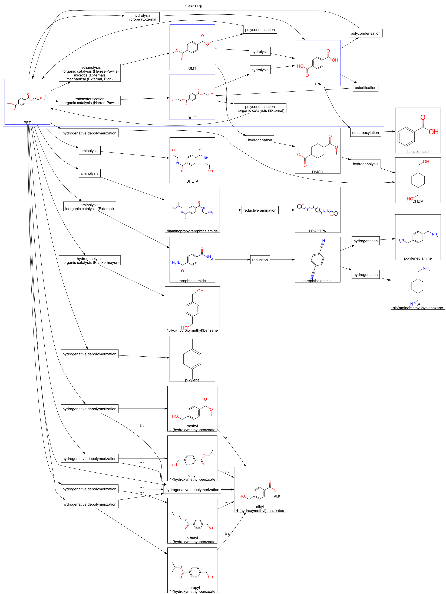

# Catalaix Knowledge Graph

This repository contains the demo for the Catalaix knowledge graph (KG):

1. the [reactions](curation/reactions.tsv) including the substrates, products,
   and literature references describing the reactions
2. the [reactions hierarchy](curation/reaction_hierarchy.tsv) which connects
   reactions with different levels of abstraction
3. a chemical ontology, including hierarchical categorization of molecules by
   structure and role (based on ChEBI) such as plasticizers and dyes
4. the [conditions](curation/conditions.tsv) including experimental information
   like the catalyst/microbe, byproducts, conditions and provenance information
   like the group that ran the reactions and literature references where the
   conditions were used
5. the [labs](curation/labs.tsv) within the consortium and their
   [members](curation/memberships.tsv)
6. literature published by labs in the consortium and important to members of
   the consortium, and an induced citation network

